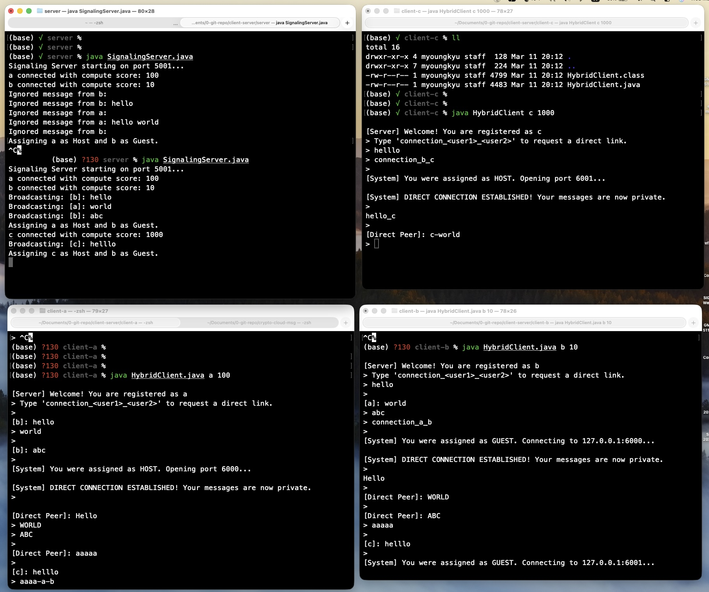

# Hybrid Client-Server P2P Chat Prototype

This is a Java-based terminal chat application that demonstrates a **Hybrid Peer-to-Peer (P2P) architecture**. 

In this prototype, a central **Signaling Server** handles initial client connections, broadcasts global messages, and tracks the computing resources of each client. When two clients want to chat privately, the server negotiates a direct P2P connection between them. It dynamically assigns the "Host" role to the client with the higher compute score and the "Guest" role to the other, completely removing itself from the subsequent private data stream.

## Features
* **Global Broadcasting:** Clients can chat in a public lobby before establishing a direct connection.
* **Resource-Aware P2P Routing:** The server compares client compute scores to determine which machine is best suited to host the direct connection socket.
* **Dynamic Port Allocation:** The server automatically assigns unique ports (starting at 6000) for new P2P connections to prevent conflicts.

## Screenshot


## How to Run

**1. Start the Signaling Server:**
Open a terminal, navigate to your server directory, compile, and run:
```bash
javac SignalingServer.java
java SignalingServer

```

**2. Start the Clients:**
Open additional terminal windows for each client. You must provide a `<username>` and a `<compute_score>` as command-line arguments.

```bash
javac HybridClient.java

# Client A (High compute resources)
java HybridClient a 100

# Client B (Low compute resources)
java HybridClient b 10

# Client C (Very high compute resources)
java HybridClient c 1000

```

## Usage & Commands

* **Global Chat:** Simply type a message and press Enter. It will be broadcasted to all connected clients.
* **Request Direct Connection:** Type `connection_<user1>_<user2>` (e.g., `connection_a_b`) and press Enter. The server will step in, assign host/guest roles based on your compute scores, and establish a private, direct socket connection between the two clients.

---

## Known Limitations / Future Work

* **Connection State Management:** If User B is in a private chat with User A, and User C requests a connection with User B, User B currently switches abruptly. Future iterations need a "busy" state on the server or a `disconnect` command to cleanly break P2P loops and return to the lobby.

### State-of-the-Art Security Architecture (E2EE)

To secure the direct P2P connections from interception, future iterations will implement a modern End-to-End Encryption (E2EE) pipeline mirroring industry standards (like Signal and TLS 1.3). This utilizes **Curve25519** for key agreement and **AES-256-GCM** for authenticated symmetric encryption.

The workflow will integrate directly into our existing Hybrid Signaling architecture:

1. **Key Generation (Curve25519):** Upon startup, each `HybridClient` generates a unique X25519 elliptic-curve key pair (a Public Key to share, and a Private Key kept strictly local).
2. **Signaling & Key Exchange:** When `Client A` requests a connection to `Client B`, the `SignalingServer` securely routes their respective X25519 Public Keys to each other during the `CMD_HOST` / `CMD_CONNECT` phase.
3. **Shared Secret Derivation (ECDH):** Using Elliptic-Curve Diffie-Hellman (ECDH), both clients independently combine their own Private Key with the other's Public Key. The mathematics of the curve guarantee that both clients arrive at the exact same **Shared Secret Key** without ever transmitting it over the network.
4. **Authenticated Encryption (AES-GCM):** * The clients use this Shared Secret Key with the **AES-256-GCM** algorithm to encrypt all subsequent chat messages.
* GCM (Galois/Counter Mode) provides both confidentiality (hiding the text) and integrity (proving the message hasn't been tampered with in transit).
* **Result:** Even if an attacker intercepts the direct P2P socket traffic, they only see computationally secure, unmodifiable ciphertext.

